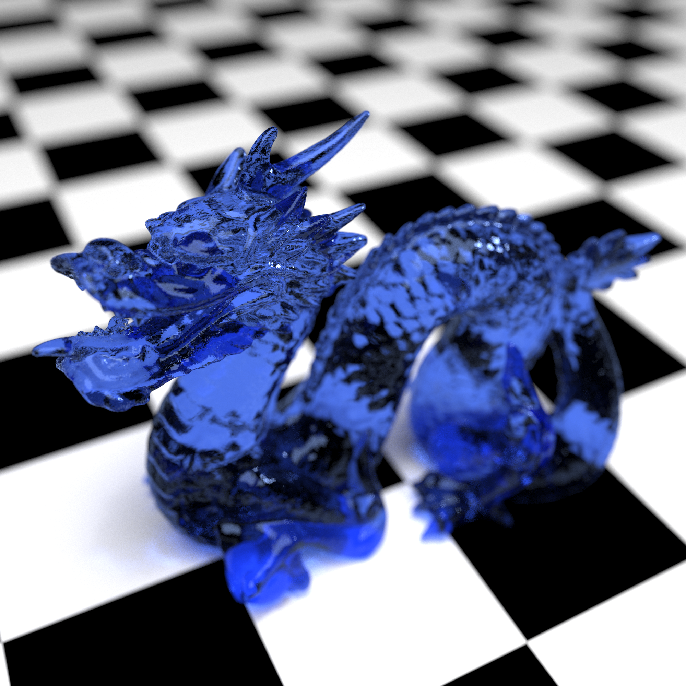
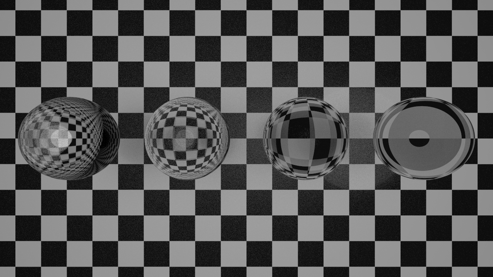
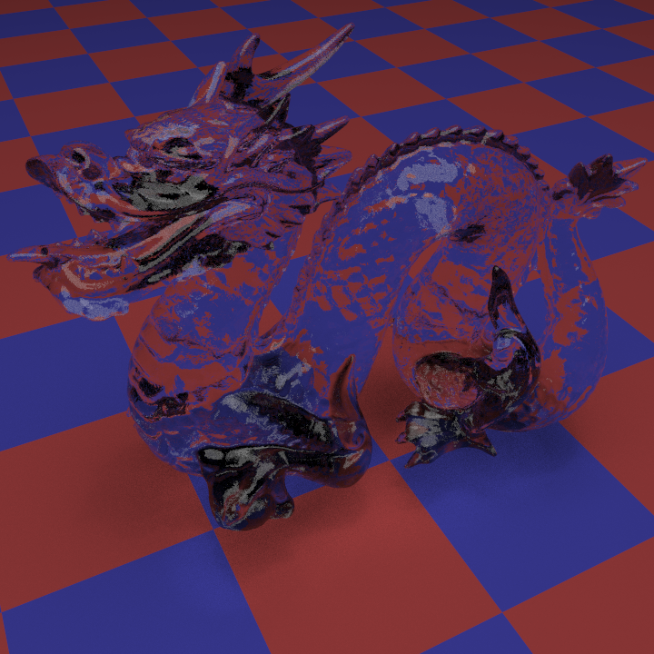
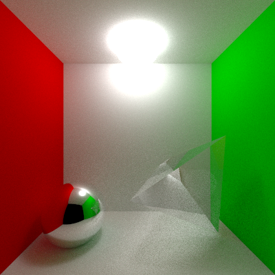
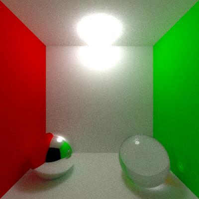

# RayTracer
(Actually a path tracer)

This is a path tracer written completely from scratch, only libraries used are [lodepng](https://github.com/lvandeve/lodepng) for image writing and [json](https://github.com/nlohmann/json) for parsing scene files. (And STL of course)

### Features
- Highly Modular with base classes defined for most features
- BxDFs:
  - Phong
  - Mirror
  - Lambertian
  - Dielectric Transmissive
  - Microfacet models (GGX, Beckmann, Phong)
  - Anistrophic Phong (Not implemented yet)
  - Disney (Not implemented yet)
- Primitives:
  - Plane
  - Quad
  - Triangle
  - Sphere
  - Polygon
  - Quadric (Not implemented yet)
- Integrators (All multithreaded):
  - Naive path tracer
  - Multiple importance sampling based path tracer
  - Bidirectional path tracer (Not implemented yet)
- Cameras:
  - Perspective Camera with Simulated Depth of Field and Sobol sampling.
  - Orthographic Camera
- Intersectors:
  - Multithreaded Bounding Volume Hierarchy Acceleration Structure (Surface Area Heuristic)
  - Naive intersector
- OBJ File Parser
- Simple to use JSON scene specification

### Building
- Tested on macOS and Linux using latest clang/apple clang.
- CMake is configured for Release and Debug modes.
- Builds to build/tracer and build/tests.
- Debugging support for VSCode using LLDB with [CodeLLDB extension](https://marketplace.visualstudio.com/items?itemName=vadimcn.vscode-lldb)

### Syntax
```
build/tracer [OPTION]... [OUTPUT IMAGE]
Arguments:
  -i, --input       path to json scene file
  -t, --threads     number of threads used by tracer
  -w, --width       width of output image
  -h, --height      height of output image
  -s, --size        can be used instead of width/height to specify square size of output image
  -d, --depth       specifies maximum ray depth
  -c, --count       number of samples taken per pixel
  --help            help
```
### Pretty Pictures
Check out `images/`! Right now, most of these images are relatively low resolution and have lower sample counts than desired. I'll render some more nice ones when I rent a high core count server.
###### 4096 samples per pixel. Notice the visible caustics from the tetrahedron in the sphere's reflection!

###### 4096 samples per pixel.

###### 500 samples per pixel.

###### 512 samples per pixel.

###### 1024 samples per pixel.

###### 256 samples per pixel.


